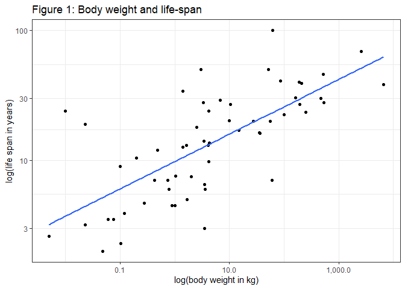
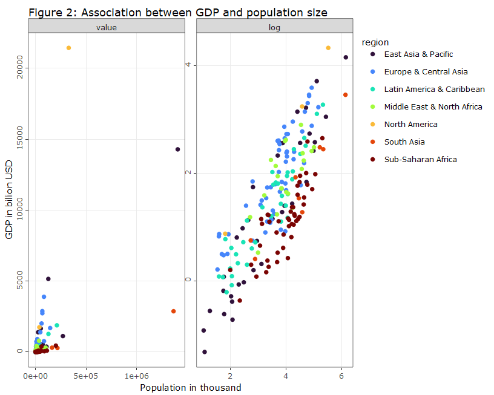

# Scale
Florian Klohn, 14 May 2022 (first version 28 Jun 2021)

``` r
#Preliminaries:

knitr::opts_chunk$set( message=FALSE, warning=FALSE) #echo = FALSE,

rm(list=ls())

library(tidyverse)
library(viridis)
library(scales)
library(stargazer)
library(WDI)
library(plotly)


theme_set(theme_light())

dir.create("filesScale", showWarnings = FALSE)
```

## Organisms & Organizations

Size matters – in many situations the formula *Y* = *a**X*<sup>*β*</sup>
can describe the empirical association between observed outcomes (Y) and
size (X), e.g. for living organisms life expectancy (Y) is found to
scale as size (X) to the power of 1/4. Geoffrey West argues in his
extraordinary book ‘Scale’ (West 2017) that networks are a key aspect in
such power laws in the biological domain, but also in cities and
companies. Crucial for his analysis is that networks (such as vessels in
animals, or pipelines in cities) are 1. invariant at their end points,
2. space filling and 3., optimization is taking place (evolution). For
the biological domain nonlinear scaling is derived for a vast number of
attributes based on these 3 assumptions, eg. there is a nonlinear
association between between animal size and blood pressure. Furthermore,
according to West the literature seems to suggest that, after taking the
logarithms of variables, these correlations regularly involve number 4.
West’s discussion of the role of scaling laws in the biological domain
suggests that the magic number is rather 4 than 42, as suggested by
Adams (2017). ;)

## Scaling Laws in Practice

Lets have a look at data from the real world (Allison and Cicchetti
1976). According to West the double-log association between life span
and body size should be about 1/4. When visualizing the correlation we
apply the common logarithm (base 10) to both variables.

``` r
#sleep.txt generated from http://lib.stat.cmu.edu/datasets/sleep
#Data import and manipulation:
sleep_raw <- read_lines(
  "filesScale/sleep.txt",
  skip = 50,
  n_max = 62
)

mplt_slr <- str_locate_all(sleep_raw, "\\s[\\d\\.\\-]") 

sleep_index <- c(1:length(sleep_raw))  

for (i in sleep_index) {
  for (j in c(1:10)) {
  str_sub(sleep_raw[i],mplt_slr[[i]][j,1], mplt_slr[[i]][j,1]) <- ","
  
}}

sleep_df <- as.data.frame(sleep_raw) %>%
          separate( col=1, sep=",",  into=c("species", "body_weight_kg", "brain_weight_g", "hrs_slow_wave_sleep", "hrs_paradoxical_sleep", "hrs_total_sleep", "maximum_life_span", "gestation_time", "predation_index", "sleeping_exp._index", "overall_danger_index")) %>%
          mutate(body_weight_kg=as.numeric(body_weight_kg), maximum_life_span=as.numeric(maximum_life_span)) %>% 
          filter(body_weight_kg!=-999 & maximum_life_span!=-999)        

#How does data look like?
sleep_df %>%
  select(species, maximum_life_span, body_weight_kg) %>%
  top_n(3) %>%
  stargazer(summary=FALSE, type="text", title="Table 1: Body weight data")
```

    ## 
    ## Table 1: Body weight data
    ## ===================================================
    ##       species      maximum_life_span body_weight_kg
    ## ---------------------------------------------------
    ## 1 African elephant      38.600           6,654     
    ## 2  Asian elephant         69             2,547     
    ## 3     Giraffe             28              529      
    ## ---------------------------------------------------

``` r
#plot scaled association between life span and life expectancy:
sleep_df %>%
  ggplot(aes(y=maximum_life_span, x=body_weight_kg)) + #, color=species
  geom_point() +
  geom_smooth(method=lm, se=FALSE, aes(color = NULL)) +
  scale_x_log10(labels = comma) + #
  scale_y_log10() +
  scale_colour_viridis_d(option = "turbo") +
  theme_bw() +
  labs(title="Figure 1: Body weight and life-span", y="log(life span in years)", x="log(body weight in kg)")
```



There is a lot of variability in the data, the slope is 0.211. But we
see an exponential association of 1/4 cannot be rejected statistically
with the data at hand:

``` r
lm(log(maximum_life_span) ~ log(body_weight_kg), data=sleep_df) %>%
  stargazer(type="text", title="Table 2: Association between life-span & body weight", align=TRUE, ci=TRUE)
```

    ## 
    ## Table 2: Association between life-span & body weight
    ## ===============================================
    ##                         Dependent variable:    
    ##                     ---------------------------
    ##                       log(maximum_life_span)   
    ## -----------------------------------------------
    ## log(body_weight_kg)          0.211***          
    ##                           (0.156, 0.266)       
    ##                                                
    ## Constant                     2.282***          
    ##                           (2.092, 2.473)       
    ##                                                
    ## -----------------------------------------------
    ## Observations                    58             
    ## R2                             0.504           
    ## Adjusted R2                    0.496           
    ## Residual Std. Error       0.670 (df = 56)      
    ## F Statistic           57.002*** (df = 1; 56)   
    ## ===============================================
    ## Note:               *p<0.1; **p<0.05; ***p<0.01

According to West, similar to animals, cities and even companies can be
described by their network structure (people are final leaves in a
network). In the context cities, there is sublinear scaling (0.85) for
the association between population and infrastructure and superlinear
scaling (1.15) in the association between population and e.g. wages.
However, other research suggests that such findings for cities may not
solely be due to optimization by intra-city processes (Ribeiro et al.
2021).

Power laws are extremely relevant in many aspects of life, and they can
emerge due to different mechanisms (Andriani and McKelvey 2006), but
underlying mechanisms are not always known yet. The role of power laws
in the success of companies, for example, can be explained with
matching: a large and successful company can hire the best employees
which leads to even higher economic outcomes (Gabaix 2016). Power laws
even emerge on the country level as shown in the following. Let us use
Worldbank data from 2019 to reveal the empirical association between
countries’ income (GDP) and population size:

``` r
# #read WB-Data from 2019:
# wdi_in <- WDI(
#   country = "all",
#   indicator = c("NY.GDP.MKTP.CD", "SP.POP.TOTL", "SP.URB.TOTL.IN.ZS"),
#   start = 2019,
#   end = 2019,
#   extra = TRUE,
#   cache = NULL,
#   latest = NULL, #=1 
#   language = "en"
# )
# saveRDS(wdi_in, "filesScale/wdi_in.rds")

wdi_in <- readRDS("filesScale/wdi_in.rds")


wdi_sel <- wdi_in %>%
  filter(region!="Aggregates")

  
p3 <- wdi_sel %>%
  mutate(sample='value', GDP=NY.GDP.MKTP.CD/1000000000, Population=SP.POP.TOTL/1000) %>%
  union(wdi_sel %>%
          mutate(sample='log', GDP=log10(NY.GDP.MKTP.CD/1000000000), Population=log10(SP.POP.TOTL/1000))) %>% 
  mutate(sample=factor(sample, levels=c("value", "log"))) %>%
  ggplot(aes(y=GDP, x=Population, text= country, color=region)) + #
  geom_point() +
  scale_colour_viridis_d(option = "turbo") +
  labs(y='GDP in billion USD', x='Population in thousand', title="Figure 2: Association between GDP and population size") +
    theme_bw() +
    theme(axis.text.y = element_text(angle=90)) +
  #, axis.title.x = element_text(margin=margin(t=60)), 
  #    axis.title.y = element_text(margin=margin(r=60))) +
  facet_wrap(~sample, scales = "free") 

ggplotly(p3)
```



A visual inspection of data (Figure 2) shows as expected: GDP increases
as population grows. However, whereas a lot of variability and extreme
values are found in the left plot where total values are shown, the
double-logarithmic scale again reveals a linear relationship of the 2
variables.

``` r
lm(log(NY.GDP.MKTP.CD) ~ log(SP.POP.TOTL), data=wdi_sel) %>%
  stargazer(type="text", title="Table 3: Association population size & GDP", align=TRUE, ci=TRUE)
```

    ## 
    ## Table 3: Association population size & GDP
    ## ===============================================
    ##                         Dependent variable:    
    ##                     ---------------------------
    ##                         log(NY.GDP.MKTP.CD)    
    ## -----------------------------------------------
    ## log(SP.POP.TOTL)             0.800***          
    ##                           (0.719, 0.880)       
    ##                                                
    ## Constant                     11.949***         
    ##                          (10.701, 13.197)      
    ##                                                
    ## -----------------------------------------------
    ## Observations                    205            
    ## R2                             0.651           
    ## Adjusted R2                    0.650           
    ## Residual Std. Error      1.397 (df = 203)      
    ## F Statistic          379.459*** (df = 1; 203)  
    ## ===============================================
    ## Note:               *p<0.1; **p<0.05; ***p<0.01

The scaling exponent using country level data suggests sublinear scaling
of about 0.8, ie. if the population doubles, GDP grows by 80 percent, on
average. However, although interesting, it would again be helpful to
understand the underlying mechanism, especially from a developmental
perspective. Should the association of income and population always be
analysed on a double-log scale? For example, the right hand side of
Figure 2 is clearly helpful if one is interested in identifying single
data points or if linear modeling is needed. But this representation
also decreases variability and can potentially hide some important
characteristics of the untransformed data.

We have seen that data from a lot of different domains can be described
by power laws, ie. associations become linear after applying the log to
the variables of interest. This holds true for living organisms, cities,
other institutions and even global structures such as countries.

## References

Adams, Douglas. 2017. *The Ultimate Hitchhiker’s Guide to the Galaxy:
The Complete Trilogy in Five Parts*. Vol. 6. Pan Macmillan.

Allison, Truett, and Domenic V Cicchetti. 1976. “Sleep in Mammals:
Ecological and Constitutional Correlates.” *Science* 194 (4266): 732–34.

Andriani, P, and B McKelvey. 2006. “On the Relevance of Extremes Vs.
Means in Organization Science: Some Theory, Research, Statistics, and
Power Law Implications.” Working paper, Durham, UK.

Arel-Bundock, Vincent. 2022. *WDI: World Development Indicators and
Other World Bank Data*. <https://CRAN.R-project.org/package=WDI>.

Gabaix, Xavier. 2016. “Power Laws in Economics: An Introduction.”
*Journal of Economic Perspectives* 30 (1): 185–206.

Hlavac, Marek. 2018. *Stargazer: Well-Formatted Regression and Summary
Statistics Tables*. Bratislava, Slovakia: Central European Labour
Studies Institute (CELSI).
<https://CRAN.R-project.org/package=stargazer>.

Ribeiro, Haroldo V, Milena Oehlers, Ana I Moreno-Monroy, Jürgen P Kropp,
and Diego Rybski. 2021. “Association Between Population Distribution and
Urban GDP Scaling.” *Plos One* 16 (1): e0245771.

Sievert, Carson. 2020. *Interactive Web-Based Data Visualization with r,
Plotly, and Shiny*. Chapman; Hall/CRC. <https://plotly-r.com>.

West, Geoffrey. 2017. “Scale: The Universal Laws of Life, Growth, and
Death in Organisms.” *Cities, and Companies. Penguin Publishing Group*.

Wickham, Hadley, and Dana Seidel. 2020. *Scales: Scale Functions for
Visualization*. <https://CRAN.R-project.org/package=scales>.
